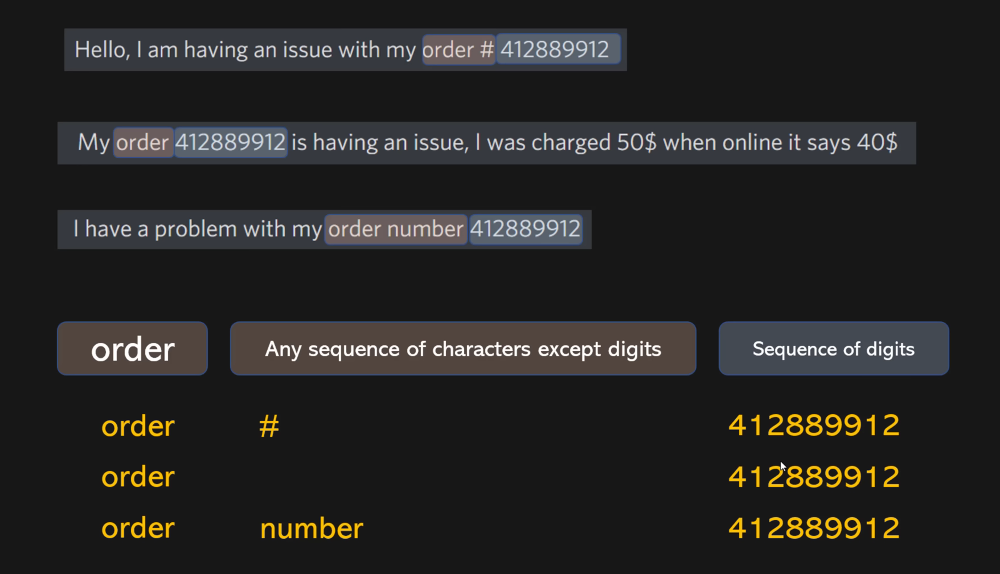
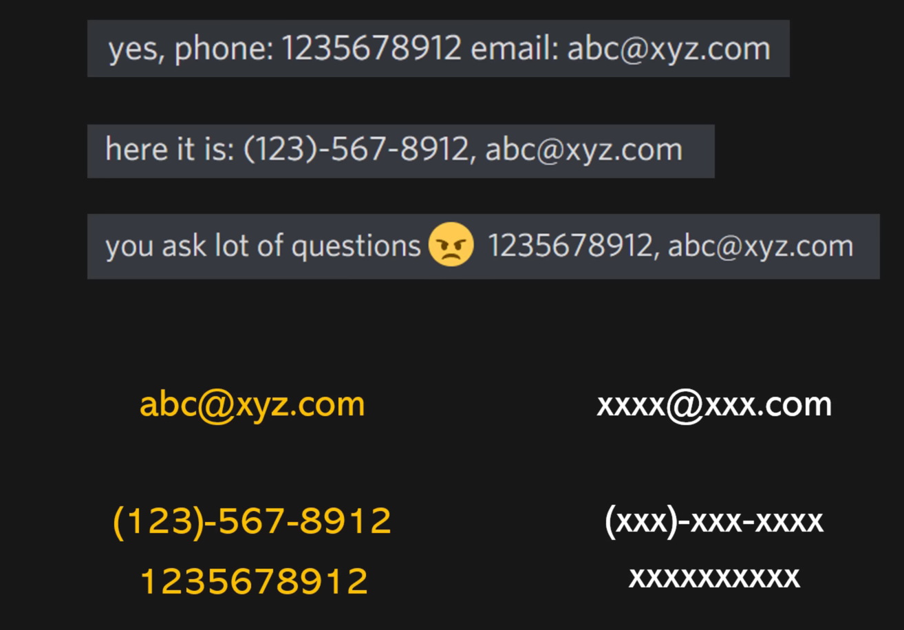

# Regex in NLP (Short Guide)

**Regex (Regular Expressions)** is a tool for pattern matching in text.  
It is very useful in NLP for text preprocessing, cleaning, and feature extraction.

---

## Common Uses in NLP
- **Tokenization**: Split text into words or sentences
- **Removing unwanted characters**: Punctuation, digits, special symbols
- **Extracting patterns**: Emails, URLs, hashtags, dates
- **Text normalization**: Standardizing formats

---

## Basic Regex Patterns

| Pattern       | Meaning                                | Example                                   |
|---------------|----------------------------------------|-------------------------------------------|
| `\d`          | Digit                                   | `re.findall("\d", "I have 2 apples") -> ['2']` |
| `\D`          | Non-digit                               | `re.findall("\D", "I have 2 apples") -> ['I',' ','h','a',...]` |
| `\w`          | Alphanumeric character                  | `re.findall("\w", "Hello!") -> ['H','e','l','l','o']` |
| `\W`          | Non-alphanumeric                        | `re.findall("\W", "Hello!") -> ['!']` |
| `\s`          | Whitespace                              | `re.findall("\s", "Hi there") -> [' ']` |
| `\S`          | Non-whitespace                          | `re.findall("\S", "Hi there") -> ['H','i','t','h','e','r','e']` |
| `.`           | Any character except newline            | `re.findall("H.", "Hi Hello") -> ['Hi','He']` |
| `^`           | Start of string                         | `re.findall("^Hi", "Hi there") -> ['Hi']` |
| `$`           | End of string                           | `re.findall("there$", "Hi there") -> ['there']` |
| `*`           | 0 or more repetitions                   | `re.findall("lo*", "Hello") -> ['lo']` |
| `+`           | 1 or more repetitions                   | `re.findall("lo+", "Hello") -> ['lo']` |
| `?`           | 0 or 1 repetition (optional)            | `re.findall("lo?", "Hello") -> ['lo']` |
| `{m,n}`       | m to n repetitions                       | `re.findall("lo{1,2}", "Helloo") -> ['loo']` |
| `[]`          | Character set                            | `re.findall("[aeiou]", "Hello") -> ['e','o']` |
| `|`           | OR operator                              | `re.findall("cat|dog", "I have a cat") -> ['cat']` |
| `()`          | Grouping                                 | `re.findall("(Hi|Hello)", "Hi there") -> ['Hi']` |

---

## Python Example

```python
import re

text = "Contact me at om.gaikwad@example.com or visit https://example.com"
emails = re.findall(r'\b[\w.-]+@[\w.-]+\.\w+\b', text)
urls = re.findall(r'https?://\S+', text)

print("Emails:", emails)
print("URLs:", urls)
```






