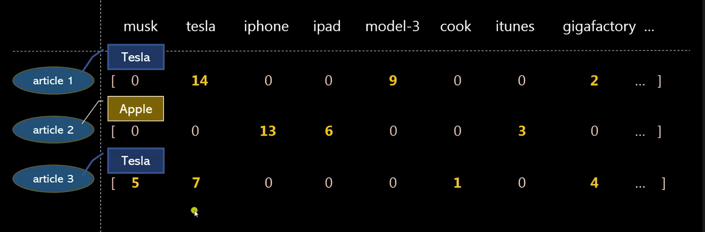

# Count Vectorizer (Bag of Words)

**Count Vectorizer** is a way to convert text into numbers using the **Bag of Words (BoW)** model.

- **Idea:** Represent each document as a vector of word counts.  
- **Steps:**
  1. Create a **vocabulary** of all unique words in the dataset.  
  2. For each document, count how many times each word appears.  
  3. Represent the document as a **vector** of these counts.  

- **Example:**  

Documents: ["I love NLP", "I love Python"]
Vocabulary: ["I", "love", "NLP", "Python"]
Vectors: [[1, 1, 1, 0], [1, 1, 0, 1]]

- **Advantages:**
- Simple and easy to implement  
- Works well for small datasets  

- **Limitations:**
- Ignores word order (loses context)  
- High-dimensional vectors for large vocabularies  
- Cannot capture meaning of words (e.g., "good" vs "great")  

> **Use case:** Text classification, spam detection, and document similarity.
