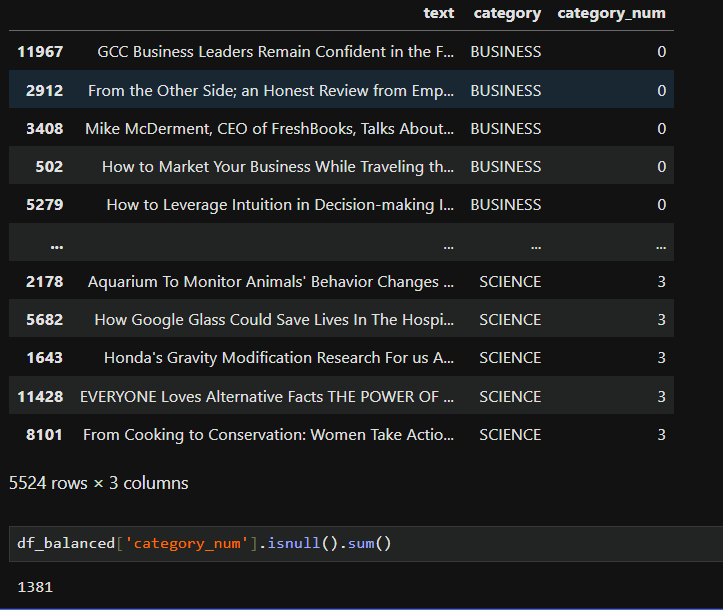
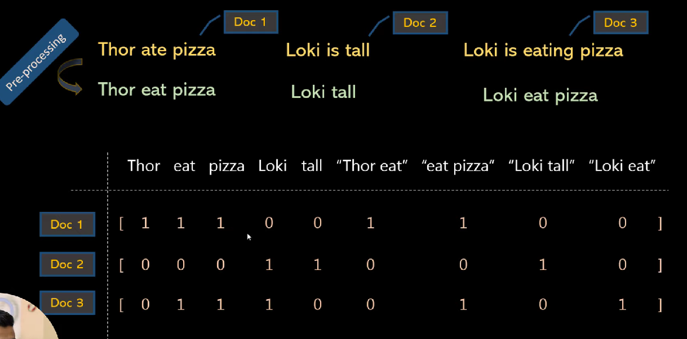
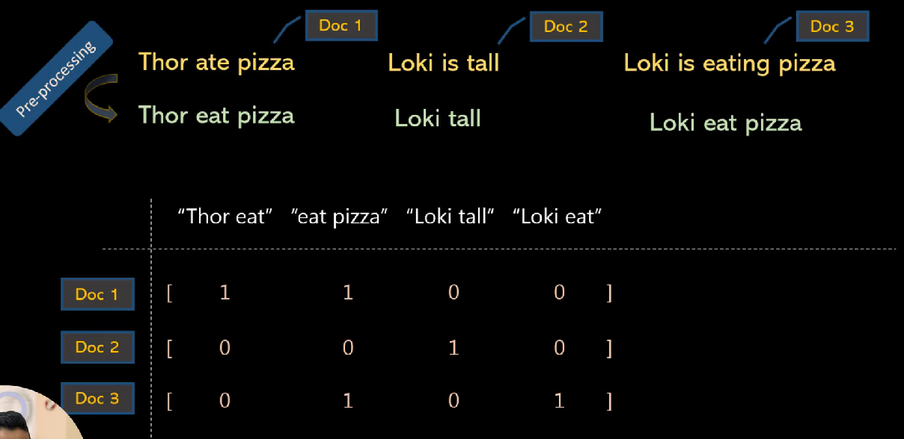
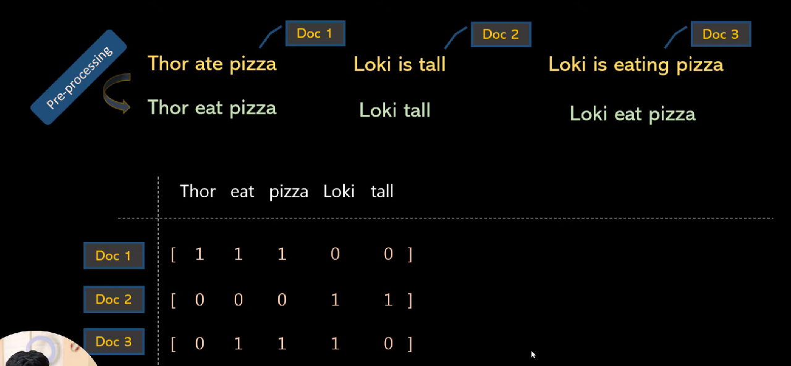
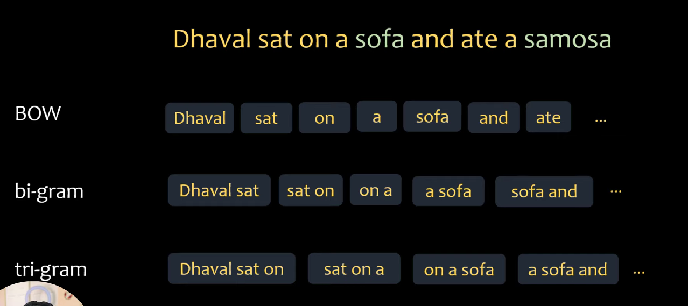
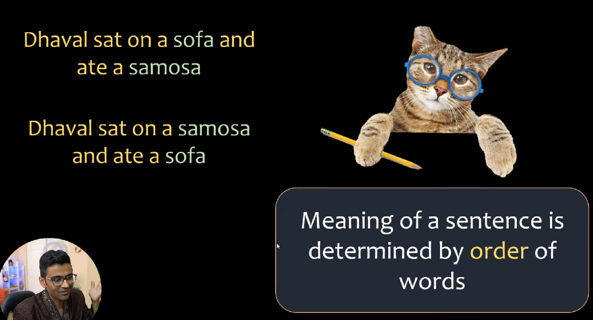

# Bag of n-grams

**Bag of n-grams** is an extension of the **Bag of Words (BoW)** model that captures sequences of words, called **n-grams**, instead of just individual words.

---

## Key Points
- **BoW Limitation:** Captures individual words but ignores the order and relationship between them.
- **n-gram Approach:** Considers sequences of `n` consecutive words, which adds partial context.

---

## Examples
Sentence:  
`"I love machine learning"`

| n-gram Type | Extracted Tokens |
|------------|----------------|
| **Unigrams (n=1)** | `["I", "love", "machine", "learning"]` |
| **Bigrams (n=2)** | `["I love", "love machine", "machine learning"]` |
| **Trigrams (n=3)** | `["I love machine", "love machine learning"]` |

---

## Advantages
- Captures **local word order** and short context.
- Improves performance in text classification and NLP tasks.

---

## Disadvantages
- **High dimensionality:** Vocabulary size grows quickly with `n`.
- **Sparsity:** Many n-grams may not appear frequently in data.

---

## Usage in ML
- Implemented using `CountVectorizer` or `TfidfVectorizer` with `ngram_range=(n, n)`.
- Often combined with classifiers like Logistic Regression, Naive Bayes, or Random Forest.

# Handling Imbalanced Data

1. **Resampling Techniques**  
   - **Oversampling**: Duplicate or synthetically generate more samples of the minority class (e.g., SMOTE).  
   - **Undersampling**: Reduce the number of majority class samples to balance the dataset.  
   - **Hybrid**: Combine oversampling and undersampling for better balance.  

2. **Algorithm-Level Approaches**  
   - Use models that handle class imbalance internally (e.g., decision trees with class weights, XGBoost with `scale_pos_weight`).  
   - Adjust class weights to penalize misclassification of minority classes more heavily.  

3. **Ensemble Methods**  
   - **Bagging & Boosting** with balanced sampling.  
   - **EasyEnsemble / BalancedRandomForest** designed for imbalance problems.  

4. **Data-Level Solutions**  
   - Collect more data from the minority class if possible.  
   - Generate synthetic data using techniques like GANs.  

5. **Evaluation Metrics**  
   - Use metrics beyond accuracy: Precision, Recall, F1-score, ROC-AUC, PR-AUC.  

---

# Why Naïve Bayes is Preferred for Text Classification

1. **Handles High-Dimensional Data**  
   - Text data often has thousands of features (words). Naïve Bayes performs well even with high-dimensional sparse data.  

2. **Efficiency**  
   - Training and prediction are very fast compared to more complex models, making it ideal for large-scale text tasks.  

3. **Works Well with Small Data**  
   - Even with limited training data, Naïve Bayes can perform surprisingly well.  

4. **Independence Assumption Fits Text Data**  
   - Words in text can often be considered conditionally independent given the class, which aligns with the Naïve Bayes assumption.  

5. **Good Baseline Model**  
   - Despite being simple, it often achieves accuracy comparable to more advanced models in tasks like spam detection, sentiment analysis, and document categorization.  
