# NLP Pipeline 

An **NLP pipeline** is the step-by-step process of converting raw text into useful insights or predictions.  

# Real-Life Example of NLP in Action

Let's take a real-life example:  
**Camtasia** is a video recording software.  
When users face issues, they raise support tickets.  

The company's task is to:
1. **Identify the most important tickets first** (high priority issues).
2. **Resolve them quickly** to improve customer satisfaction.

They use **NLP** to:
- Analyze ticket text.
- Detect urgency and categorize issues.
- Prioritize tickets automatically.

This helps the support team focus on the most critical problems first.

---

## 1. **Text Collection**
- **What:** Gather raw text data from multiple sources.  
- **Sources:** Social media (tweets, reviews), websites, chat logs, documents, datasets.  
- **Goal:** Get enough representative data for training and analysis.  

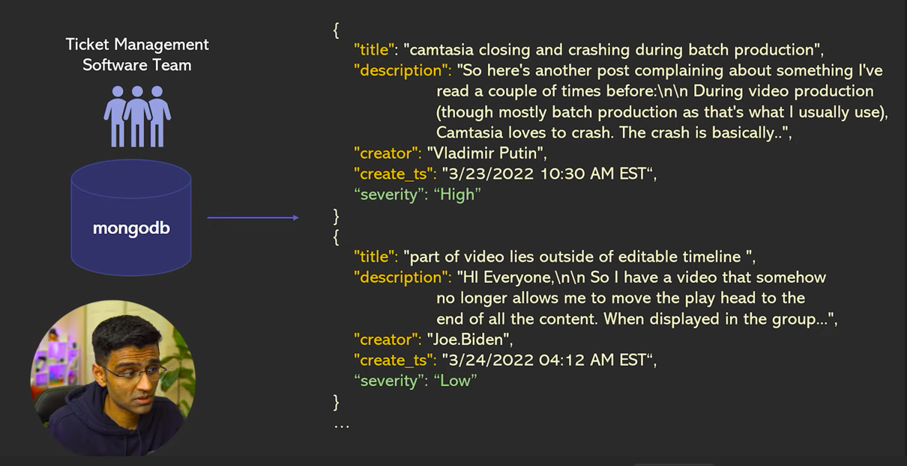
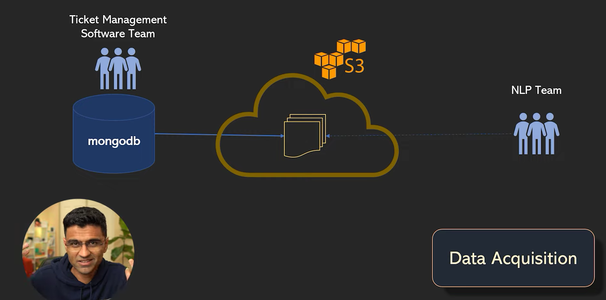  

---

## 2. **Text Cleaning & Preprocessing**
- **Lowercasing:** Convert all text to lowercase.  
- **Remove noise:** Punctuation, numbers, special characters.  
- **Stopword removal:** Remove words like "the", "is", "and" that add little meaning.  
- **Handling missing values:** Remove empty rows or fill missing text.  
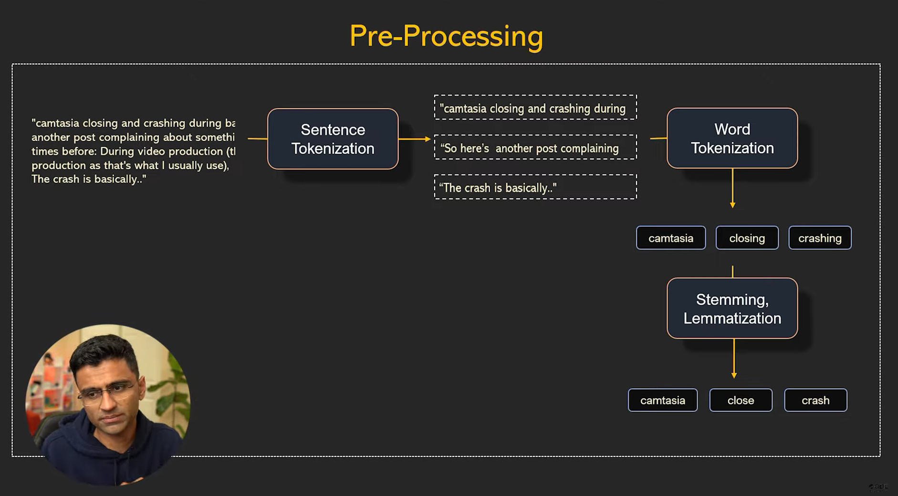  
---

## 3. **Tokenization**
- **Word Tokenization:** Split text into words → ["I", "love", "NLP"]  
- **Sentence Tokenization:** Split text into sentences.  
- **Why:** Makes it easier to process text mathematically.  

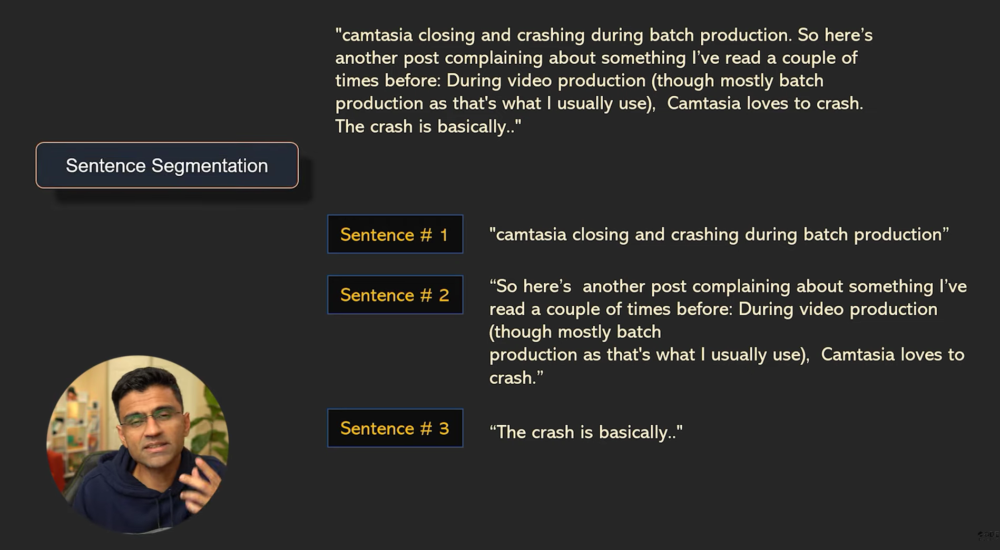  
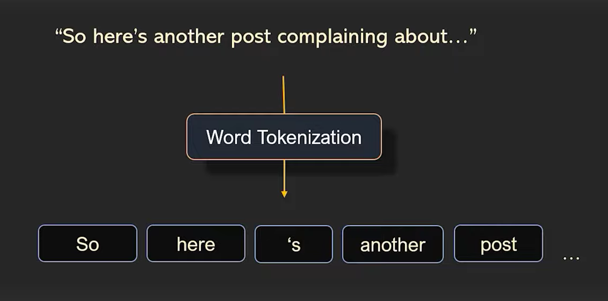  
---

## 4. **Text Normalization**
- **Stemming:** Roughly cut words to root form → "running", "runs" → "run"  
- **Lemmatization:** Use linguistic rules → "better" → "good"  
- **Goal:** Treat different forms of a word as the same feature.  

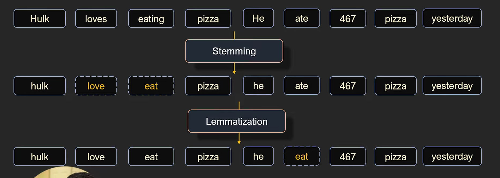  
---

## 5. **Feature Extraction / Representation**
Convert text into **numeric format** so ML/DL models can process it:
- **Bag of Words (BoW):** Word counts in text.
- **TF-IDF:** Weighted word importance.
- **Word Embeddings:** Dense vector representation (Word2Vec, GloVe).
- **Contextual Embeddings:** Use Transformers (BERT, GPT) for better meaning capture.
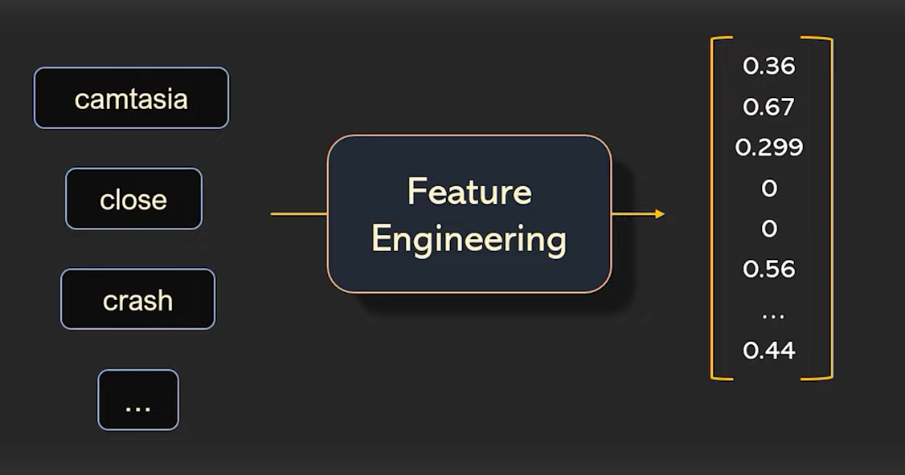  
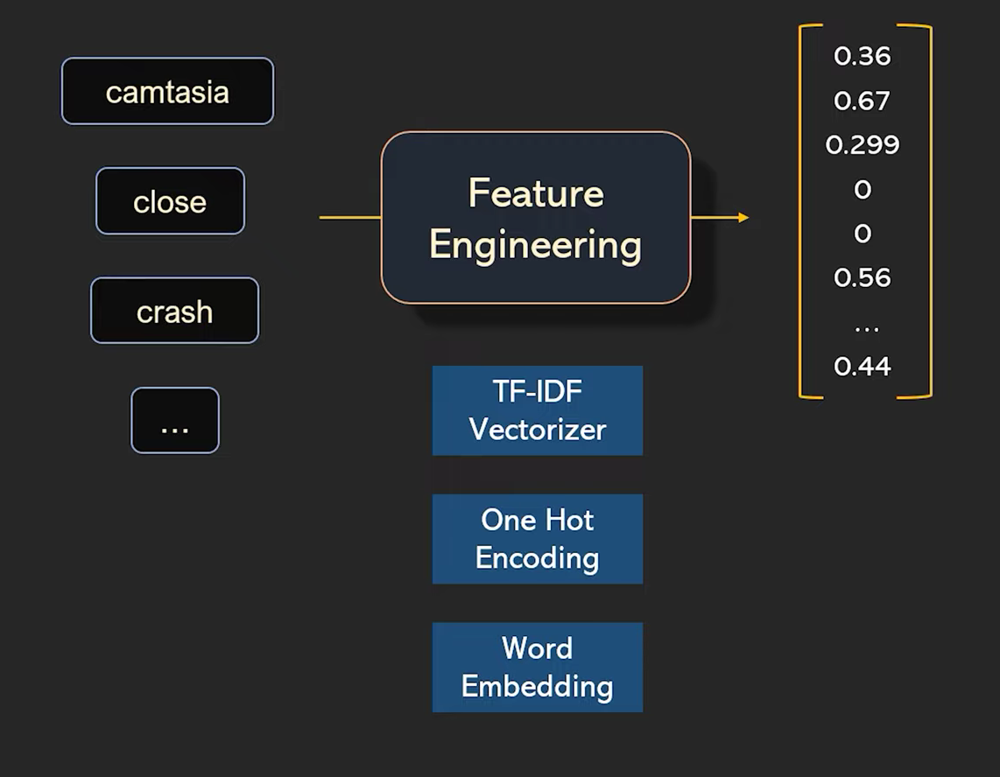  

---

## 6. **Model Building**
- **Classical ML Models:** Naive Bayes, Logistic Regression, SVM, Random Forest.
- **Deep Learning Models:** RNN, LSTM, GRU, Transformers.
- **Task Examples:** Sentiment analysis, classification, summarization, translation.
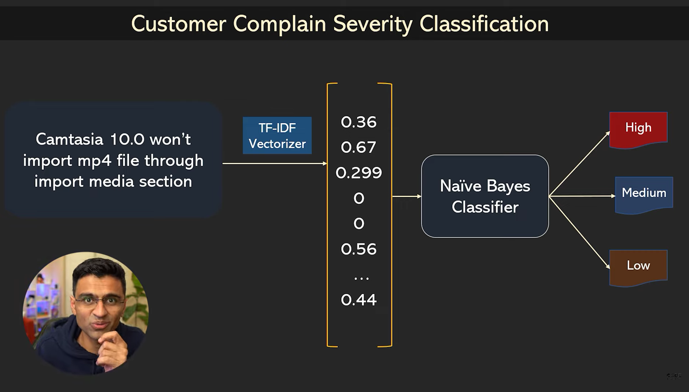  

---

## 7. **Model Evaluation**
- **Metrics:** Accuracy, Precision, Recall, F1-score, ROC-AUC.
- **Validation:** Cross-validation, train-test split.
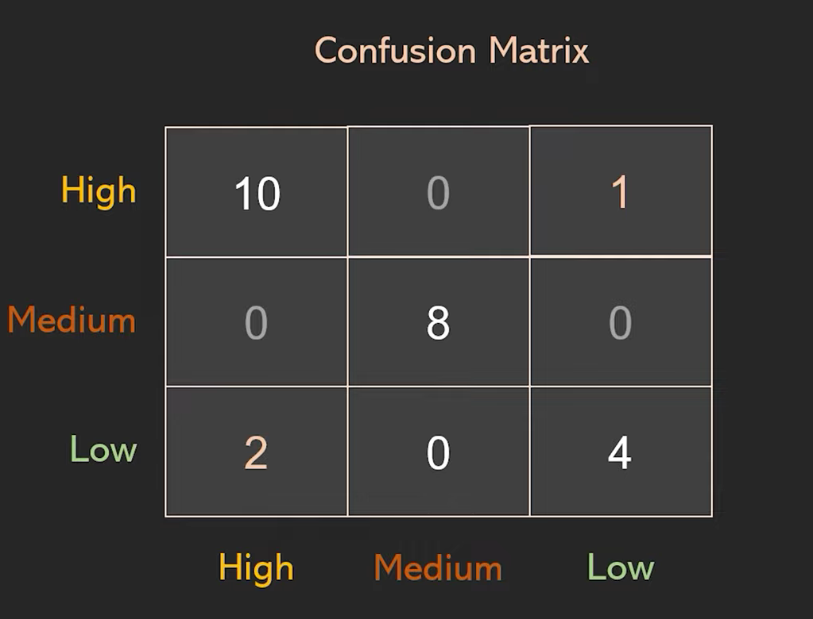  

---

## 8. **Deployment**
- **Goal:** Make the model available for real-world use.
- **Ways:** REST API, Web app, Chatbot, Integration in product pipeline.
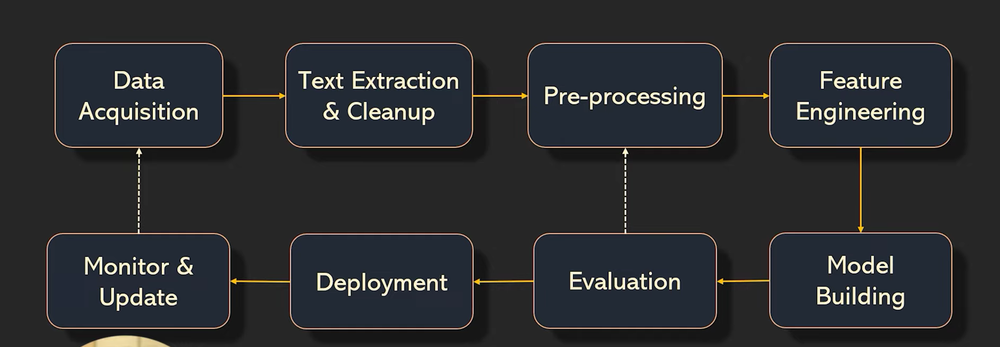  

---

## Summary Table

| Step                | Purpose / Tools                          |
|--------------------|-----------------------------------------|
| Text Collection    | Gather data (scraping, APIs, datasets) |
| Cleaning           | Lowercasing, stopword removal, noise cleaning |
| Tokenization       | Split into words/sentences (NLTK, spaCy) |
| Normalization      | Stemming, Lemmatization (NLTK, spaCy) |
| Feature Extraction | BoW, TF-IDF, Word2Vec, BERT (scikit-learn, gensim, transformers) |
| Model Building     | ML/DL models (scikit-learn, TensorFlow, PyTorch) |
| Evaluation         | Accuracy, F1-score, confusion matrix |
| Deployment         | Flask, FastAPI, Streamlit, Docker |

